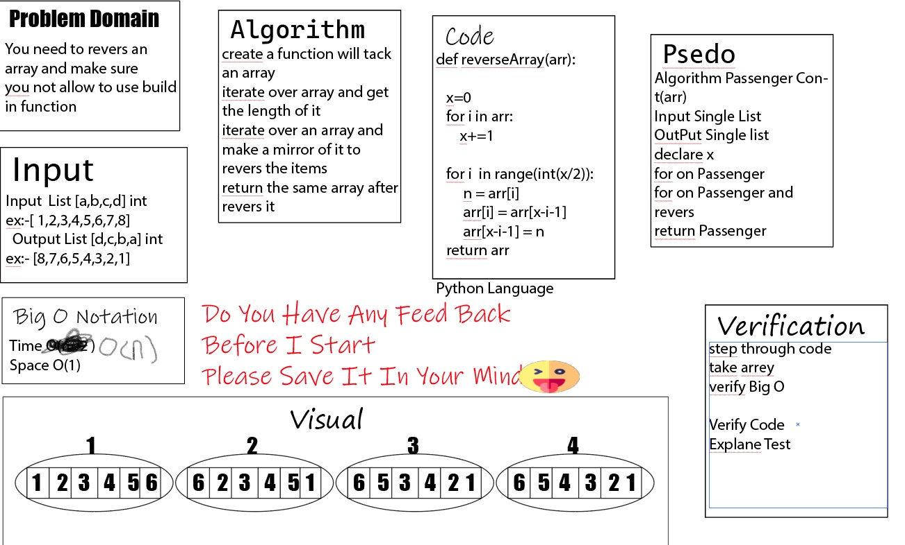

# Reverse an Array
 Made a function called reverseArray that tack an array and return revers for this array 
    without use any build in function 
  example:- 
  Input [1,2,3,4,5,6,7,8]
  Output [8,7,6,5,4,3,2,1]

## Whiteboard Process

## Approach & Efficiency
O(n^2)