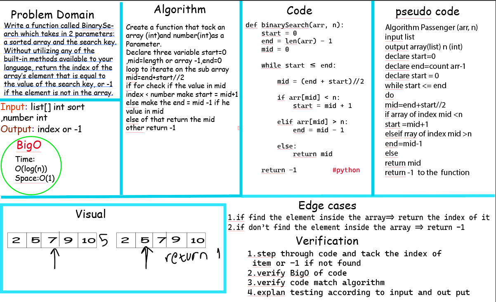

array_binary_search
# Reverse an Array
 create a function called binarySearch that
 tack an array on sorted number and number then return the index if it founded or -1 if it not founded inside the array but must use the binary search algorithm 
  example:- 
  Input [1,2,3,4] , 5
  Output -1

## Whiteboard Process

## Approach & Efficiency
declare the variable that tack middle index and then loop to iteration on the arr from the middle 
to change it to the input number that tack from the argument and shift all the still numbers on the last of an array then return this array 

Efficiency
time :O(log(n)) the time is related of the binary search algorithm in the wast  case 
space:O(1) that because i didn't use declare any list or dictionary 