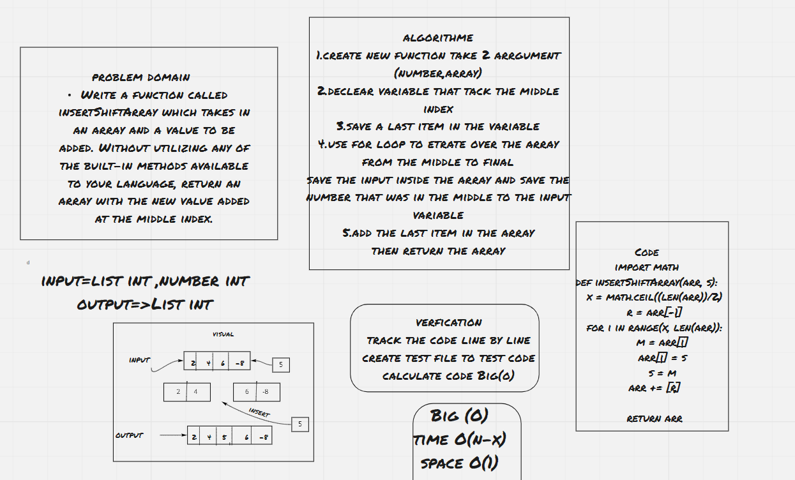

# Reverse an Array
 create a function called arrayInsertShift that tack an array and number as input 
 and insert the number in the middle of array then return the array
  example:- 
  Input [1,2,3,4] , 5
  Output [1,2,5,3,4]

## Whiteboard Process

## Approach & Efficiency
declare the variable that tack middle index and then loop to iteration on the arr from the middle 
to change it to the input number that tack from the argument and shift all the still numbers on the last of an array then return this array 

Efficiency
time :O(n-x) the time is related of how much items inside array of n-x that iterated on the on the array from middle index so x here equal middle index and n equal count of array  
space:O(1) that because i didn't use declare any list or dictionary and I think that the best way and have a 
little bit of space  