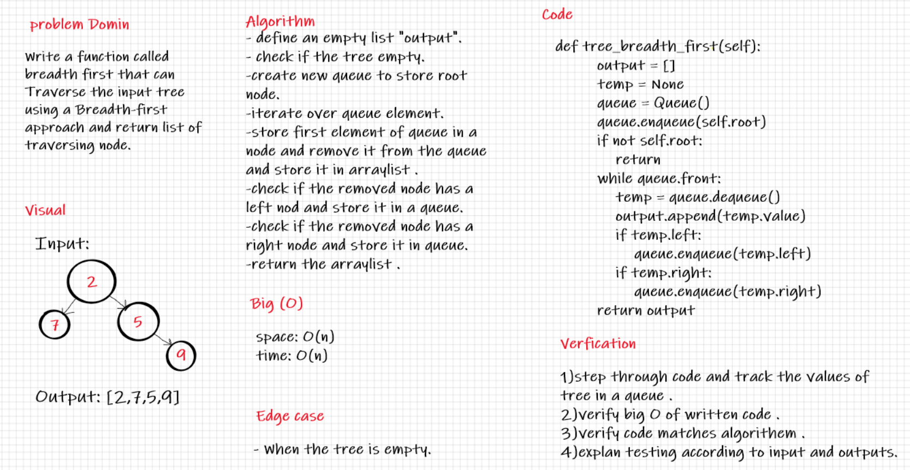

# Challenge Summary
Write a function called breadth first:
Arguments: tree.
Returns: list of all values in the tree, in the order they were encountered.

## Whiteboard Process

## Approach & Efficiency
Big (O):
Time --> O(n) because Im used a while loop to looping over an tree elements
Space --> O(n) because Im used an array to save an elements in it.

