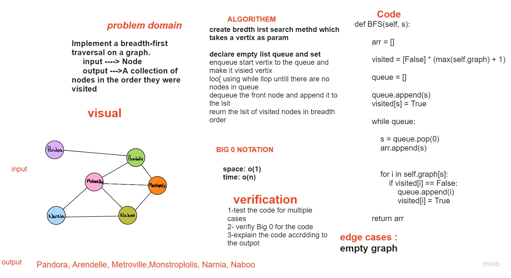

# Challenge Summary
Implement a breadth-first traversal on a graph.

## Whiteboard Process

## Approach & Efficiency
Space bigO(n)
Time bigO(n)

## Solution
Loop over the node in the graph and append there node item in the array as breadth-first approach 
