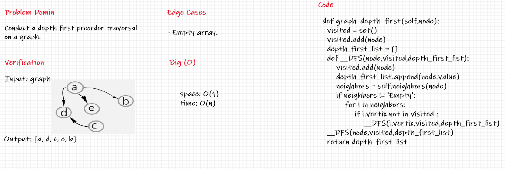

# Depth First Traversal
Write the following method for the Graph class:

Name: Depth first
Arguments: Node (Starting point of search)
Return: A collection of nodes in their pre-order depth-first traversal order
Program output: Display the collection

## Challenge

## Approach & Efficiency
Big O:
Time: O(n)
Space: O(1)

## Solution
print graph as depth first approach 