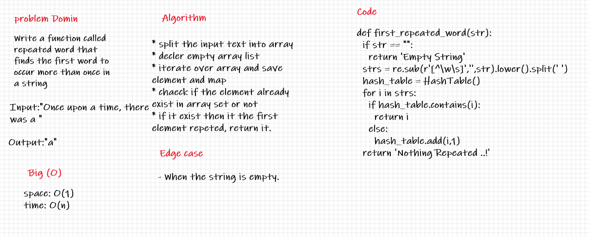

# Challenge Summary ( Hashmap Repeated Word )
Write a function that accepts a lengthy string parameter.
Without utilizing any of the built-in library methods available to your language, return the first word to occur more than once in that provided string.

## Whiteboard Process

## Approach & Efficiency
Space : bigO(1)
Time : bigO(n)

## Solution
use hash table to return which word is the most repeated in the string 
