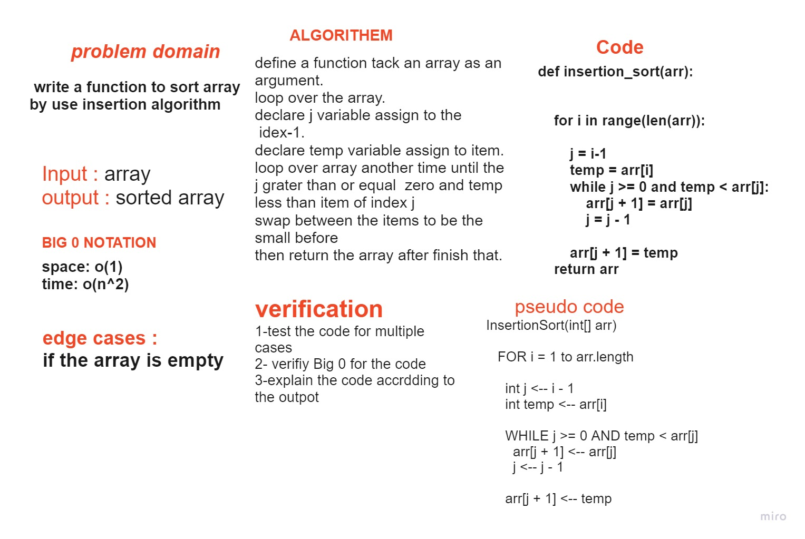
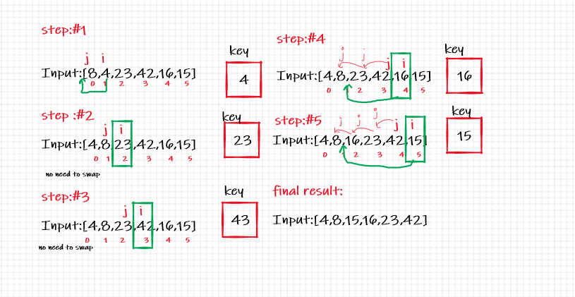

# Challenge Summary
Insertion Sort is a sorting algorithm that traverses the array multiple times as it slowly builds out the sorting sequence. The traversal keeps track of the minimum value and places it in the front of the array which should be incrementally sorted.

## Whiteboard Process

## Approach & Efficiency
Time: O(n^2)
The basic operation of this algorithm is comparison. This will happen n*(n-1) number of times, concluding the algorithm to be n squared.
Space: O(1)
because no declare a new list

## Solution
- To sort an array of size n in ascending order:
- Iterate from arr[1] to arr[n] over the array.
- Compare the current element (key) to its predecessor.
- If the key element is smaller than its predecessor, compare it to the elements before.
- Move the greater elements one position up to make space for the swapped element.