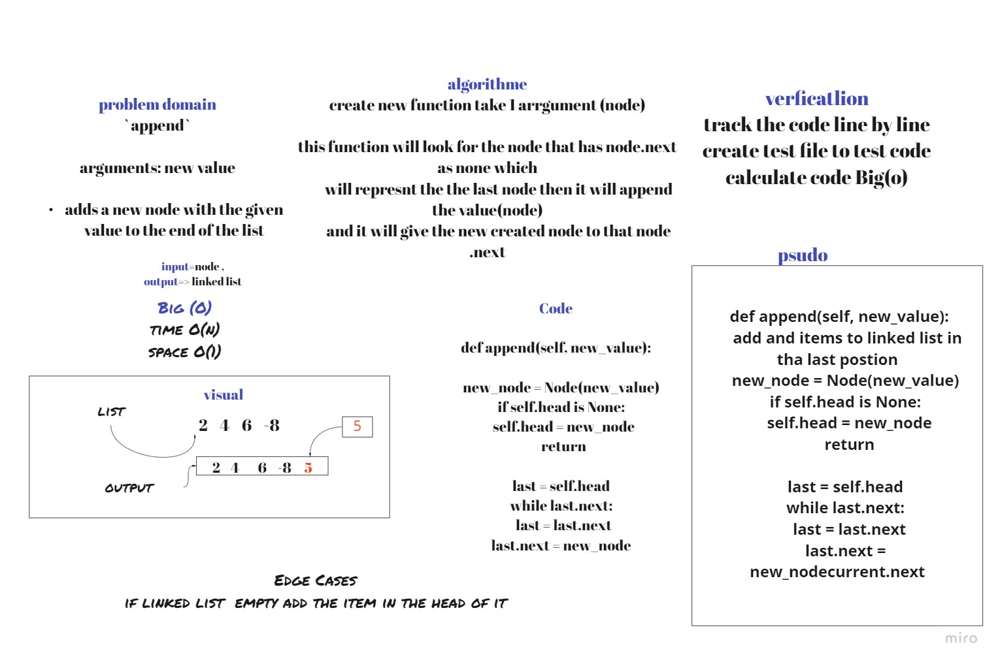
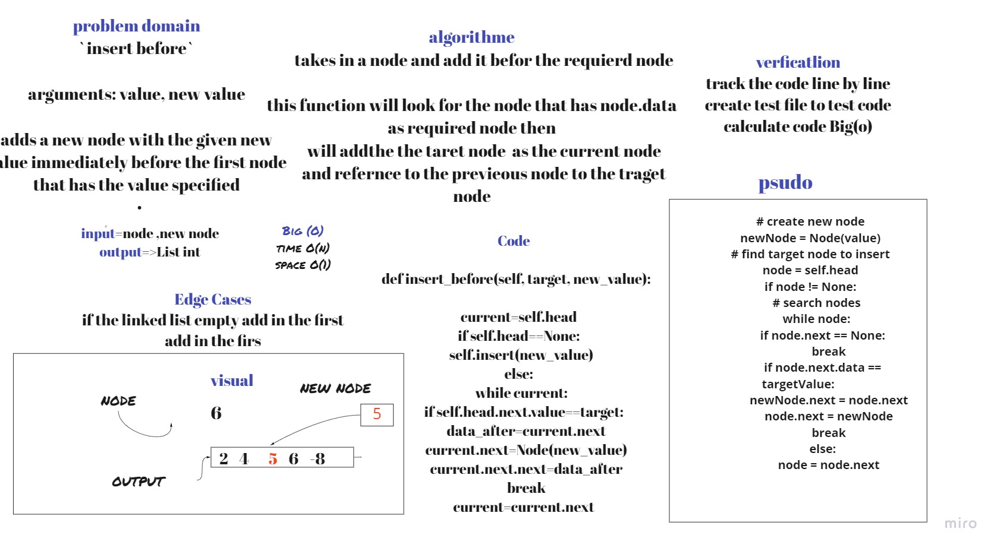
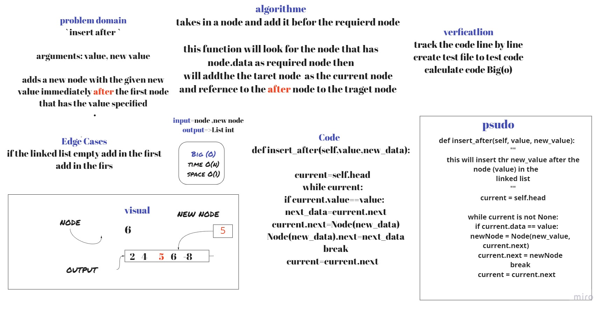
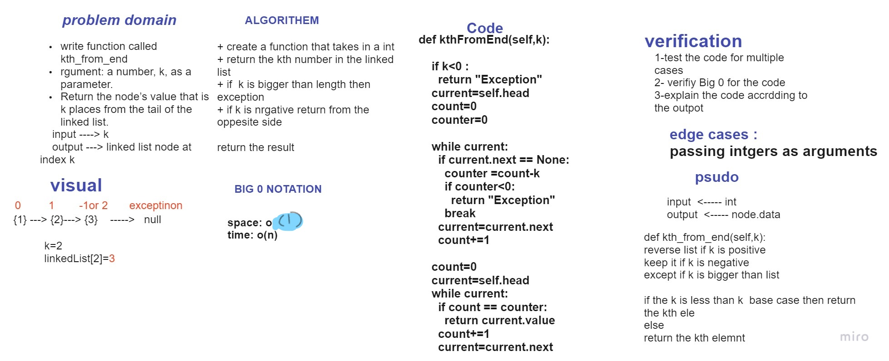
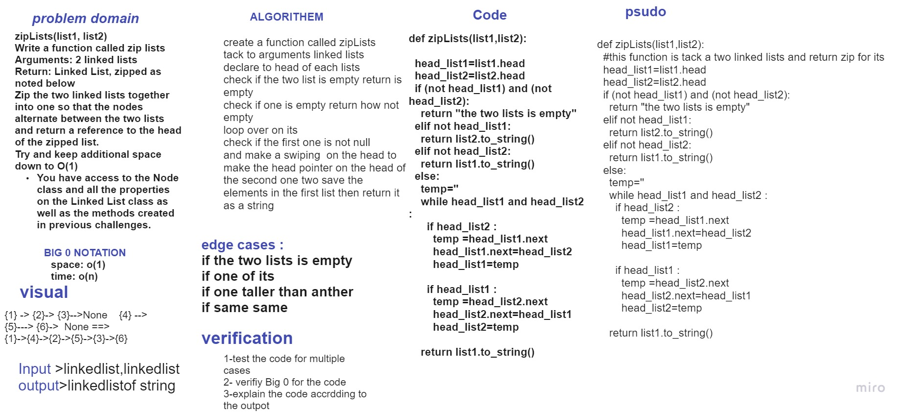

# Singly Linked List
Node
Create a Node class that has properties for the value stored in the Node, and a pointer to the next Node.
Linked List
Create a Linked List class
Within your Linked List class, include a head property.
Upon instantiation, an empty Linked List should be created.
The class should contain the following methods
insert,includes,to string

## Challenge
make the code clear and includes function 

## Approach & Efficiency
<!-- What approach did you take? Why? What is the Big O space/time for this approach? -->
If you just want to insert an element right to the beginning of the LinkedList, that can be done in constant time O(1).
If you want to delete an element at the beginning of a LinkedList, again constant time O(1).
If you want to append an item at the end of the list, that might require going through the whole LinkedList, until you reach the very last element, and then inserting the element, this would take Linear time O(n).
## API
<!-- Description of each method publicly available to your Linked List -->
insert
Arguments: value
Returns: nothing
Adds a new node with that value to the head of the list with an O(1) Time performance.
includes
Arguments: value
Returns: Boolean
Indicates whether that value exists as a Node’s value somewhere within the list.
to string
Arguments: none
Returns: a string representing all the values in the Linked List, formatted as:
"{ a } -> { b } -> { c } -> NULL"

append
arguments: new value
adds a new node with the given value to the end of the list
whiteBoard :
insert before
arguments: value, new value
adds a new node with the given new value immediately before the first node that has the value specified
whiteBoard :
insert after
arguments: value, new value
adds a new node with the given new value immediately after the first node that has the value specified
whiteBoard :

kth from end
argument: a number, k, as a parameter.
Return the node’s value that is k places from the tail of the linked list.
You have access to the Node class and all the properties on the Linked List class as well as the methods created in previous challenges.
whiteBoard :

zipLists(list1, list2)
Write a function called zip lists
Arguments: 2 linked lists
Return: Linked List, zipped as noted below
Zip the two linked lists together into one so that the nodes alternate between the two lists and return a reference to the head of the zipped list.
Try and keep additional space down to O(1)
You have access to the Node class and all the properties on the Linked List class as well as the methods created in previous challenges.
whiteBoard :

