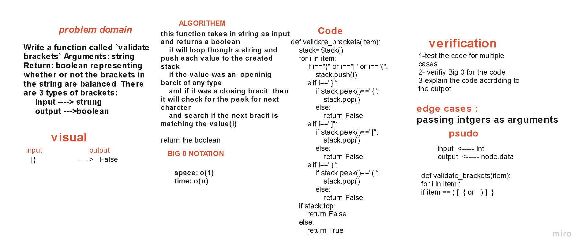

# Challenge Summary
Multi-bracket Validation check if every start brackets have a close one.
and return boolean

## Whiteboard Process

## Approach & Efficiency
space :bigO(1)
Time :bigO(n)

## Solution
use a stack to add the char if it one of brackets [{(
then check if it close it for it make a pop from 
the stack then check if the stack empty return true any thing else return false 

