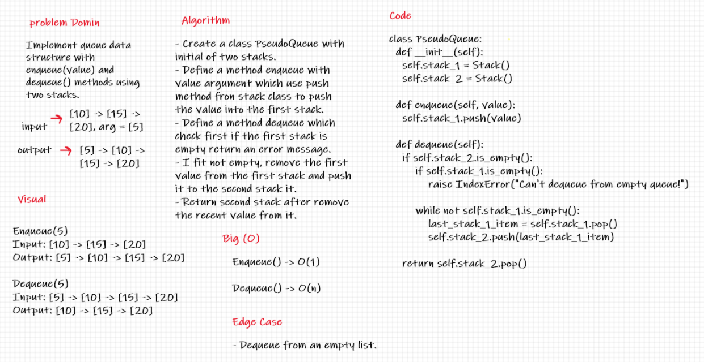

# Challenge Summary
define a class PseudoQueue that use two stack to implementation queue

## Whiteboard Process

## Approach & Efficiency
class have two method 
enqueue space O(1) time O(1)
Arguments: value
Inserts value into the PseudoQueue, using a first-in, first-out approach.
dequeue space O(1) time O(n) because it have a while loop.
Arguments: none
Extracts a value from the PseudoQueue, using a first-in, first-out approach.

## Solution
use two stack to make a queue have two method enqueue and dequeue.

