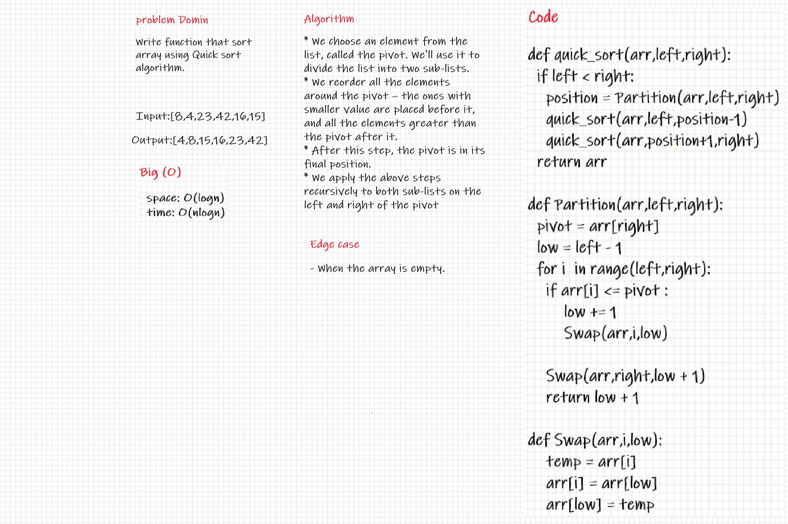

## Challenge Summary
Provide a visual step through for each of the sample arrays based on the provided pseudo code.
Convert the pseudo-code into working code in your language.
Present a complete set of working tests.

## White Board

## Approach & Efficiency
Time: O(n.logn)
Because the list is being split in log(n) calls and the merging process takes linear time in each call.
Space: O(1)
This list is being sorted in place, keeping the space at constant O(1).

## Solution 
Sort array by use quick sort algorithm