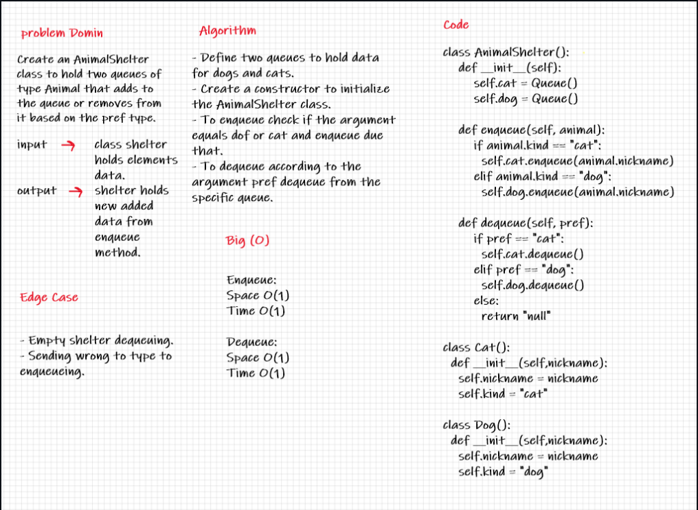

# Challenge Summary
First-in, First out Animal Shelter.
use Queue to Animal Shelter and add to it just cat or dog object

## Whiteboard Process

## Approach & Efficiency

enqueue
space O(1)
time O(1)
dequeue
space O(1)
time O(1)

## Solution
use two queue one for cat and second for dog

