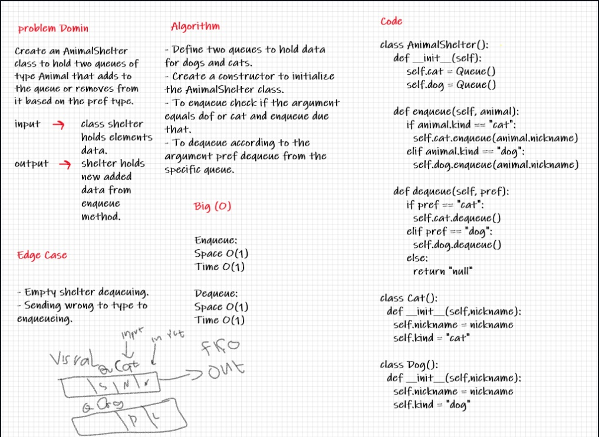

# Challenge Summary
First-in, First out Animal Shelter.
use Queue to Animal Shelter and add to it just cat or dog object

## Whiteboard Process

## Approach & Efficiency

enqueue add animal can be either a dog or a cat object.
space O(1)
time O(1)
dequeue 
Arguments: pref
pref can be either "dog" or "cat"
Return: either a dog or a cat, based on preference.
If pref is not "dog" or "cat" then return null.
space O(1)
time O(1)

## Solution
use two queue one for cat and second for dog

