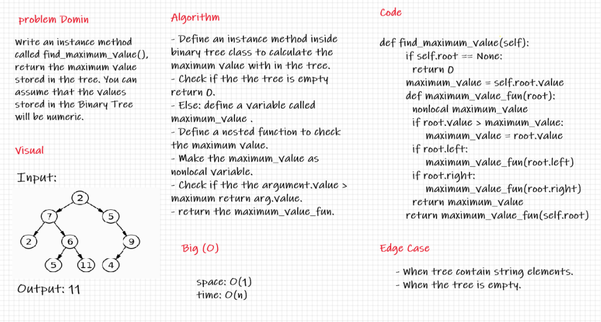

# Trees
## Binary Tree
A binary tree is a rooted tree that is also an ordered tree (a.k.a. plane tree) in which every node has at most two children. A rooted tree naturally imparts a notion of levels (distance from the root), thus for every node a notion of children may be defined as the nodes connected to it a level below.

## Challenge

Create a Node class that has properties for the value stored in the node, the left child node, and the right child node.
Create a Binary Tree class
Define a method for each of the depth first traversals:
pre order, in order and post order .
Any exceptions or errors that come from your code should be semantic, capture-able errors. For example, rather than a default error thrown by your language, your code should raise/throw a custom, semantic error that describes what went wrong in calling the methods you wrote for this lab.
Create a Binary Search Tree class
This class should be a sub-class (or your languages equivalent) of the Binary Tree Class, with the following additional methods: add and contain

## Approach & Efficiency
                   space         time
pre_order          bigO(n)       bigO(n)
in_order           bigO(n)       bigO(n)
post_order         bigO(n)       bigO(n)
Add method         bigO(1)       bigO(n)
Contains method    bigO(1)       bigO(n)
## API
###### pre_order method:
print the tree in the array with use depth way as a pre order.
##### in_order method:
print the tree in the array with use depth way as a In order.
##### post_order method:
print the tree in the array with use depth way as a post order.

##### Add method:
tack a value  and adds it to new node with that value in the correct location in the binary search tree.
#### Contains method:
tack a value  and check if it found inside a tree

## Maximum Value in a Binary Tree
Challenge
Write the following method for the Binary Tree class.

Find maximum value:

Arguments: none.
Returns: number.
Find the maximum value stored in the tree. You can assume that the values stored in the Binary Tree will be numeric.
Approach & Efficiency
Big (O):
Time --> O(n)
Space --> O(1)

## Whiteboard 
